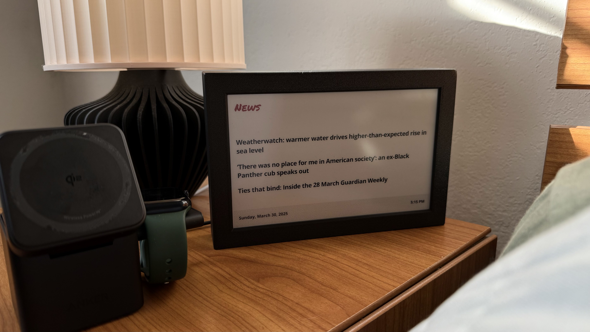
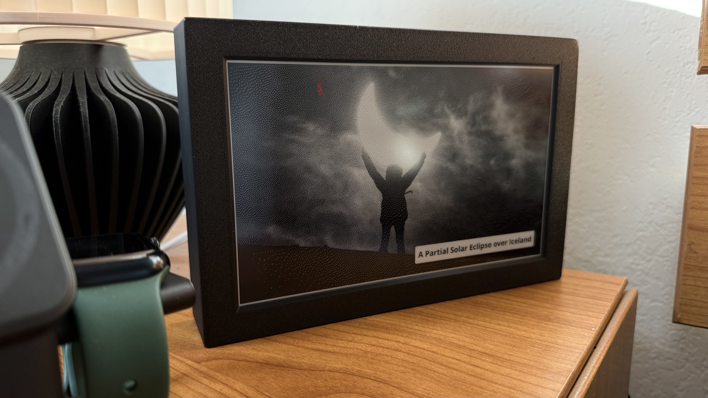

# Scripts for displaying html (React) on remote E-ink display

| News                                                  | Nasa Photo of the Day                                          |
| ----------------------------------------------------- | -------------------------------------------------------------- |
|  |  |

## Basics

- Currently only works with Waveshare e-ink displays. (could be updated to work
  with other brands easily)
- This script currently runs on a Raspberry pi zero w that's connected to the
  net.
- It fetches a list of frame screens to be displayed via
  [val.town](https://www.val.town/x/michaelwschultz/eink-frame) (feel free to use your own backend)
- That list is then used to fetch the the next image in rotation based on which
  one is currently being displayed on the connected eink display derived from
  state.json.


## Setup

- Create a free account on val.town and **remix** the [eink-frame project](https://www.val.town/x/michaelwschultz/eink-frame)
- Remove or add any frames you want and make sure to update the list near the beginning of index.tsx to include all the frames you want your device to pull from
- Follow the README, as you'll also need a [Flash API](https://flashapi.com) api key for image generation.
- Clone this repo to your arduino or raspberry pi. Make sure you're device has internet access.
- Update the `BACKEND_URL` in [fetch_and_display_image.py](https://github.com/michaelwschultz/eink-frame/blob/main/fetch_and_display_image.py) with your remix of the val.town project
- You may also need to update the imported waveshare eink display you're using in [send_to_display.py](https://github.com/michaelwschultz/eink-frame/blob/main/send_to_display.py)


## Usage

```shell
pip install -r requirements.txt
python fetch_and_display_image.py
```

You can also tell it which frame to display using the param -F or --frame.
```shell
python fetch_and_display_image.py --frame weather
```

### Remote backend for fetching data

For ease of iteration, the backend was created on
[val.town](https://www.val.town/x/michaelwschultz/eink-frame). There you can view
each frame and remix them if you'd like. You can view the image that will be
sent down to the pi and make any changes you'd like. You can also control the
list of images you'd like to show up on your pi so you don't have to log into
the pi to change anything once it's set up.

### Add startup process using pm2

```shell
pm2 start fetch_and_display_image.py --name fetch_and_display --no-autorestart --cron "0 7,19 * * *"
pm2 save
pm2 startup

pm2 logs fetch_and_display
```

## Hardware

Optional [button](./hardware/button.py) and [rotary](./hardware/rotary.py)
button scrips available.

## 3D Printing (more frames to come)

Right now, I'm using
[this design](https://makerworld.com/en/models/787533-waveshare-7-5-inch-e-paper-case#profileId-725479).

Here's
[another design](https://www.printables.com/model/219811-waveshare-75-e-paper-case-symmetrical-borders)
if you're interested in adding a battery to your setup.
